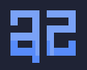

<p align="center">
  
  <h1 align="center">az</h1>
  <h3 align="center">The TUI text editor you've always wanted</h3>
</p>

<p align="center">
  <strong>A ridiculously fast, lightweight & sane terminal text editor built in Rust. Batteries included.</strong><br>
  Keyboard-first but <strong>mouse-supported</strong>, zero-configuration, and designed to stay out of your way<br>A perfect alternative to Vim and Nano<br>With more than <strong>150 language/syntax</strong> support.</i><br>
  <a href="USER_MANUAL.md">User Manual</a> |
  <a href="CHANGELOG.md">Changelog</a> |
  <a href="AGENTS.md">AI Agent Guide</a>
</p>

<p align="center">
  <a href="https://github.com/arazgray/az/releases">
    
  </a>
  
  
  
</p>

<p align="center">
  
</p>

---

## Installation

### One-line installer

The easiest way to install `az` is with the official installer:

```sh
curl -fsSL https://raw.githubusercontent.com/arazgray/az/refs/heads/main/install.sh | sh
```

The installer automatically detects your operating system and installs the appropriate prebuilt package.

No Rust toolchain or compilation is required.

After installation:

```sh
az
```

> **Update checks:** `az` automatically checks the main repository for newer releases when it starts. When one is found, a dialog offers a one-click **Update and restart** (with a success notice and restart button) instead of a command to retype. Checks are skipped when offline. Set `AZ_NO_UPDATE_CHECK=1` to disable update checks.

---

## Packages

Prebuilt packages are available for Linux, macOS, and Windows (x86_64 + ARM64)
on the [releases page](https://github.com/arazgray/az/releases/latest):

- Linux (generic tarball, x86_64 + ARM64)
- Debian / Ubuntu / Mint / Pop!_OS (`.deb`, x86_64 + ARM64)
- Fedora / RHEL / openSUSE (`.rpm`, x86_64 + ARM64)
- macOS Apple Silicon and Intel (tarball)
- Windows (`.exe`, x86_64 + ARM64)

Tagged releases are built by [`.github/workflows/release.yml`](.github/workflows/release.yml);
Linux packages can also be reproduced locally with `./dist/package.sh`.
The one-line installer below already knows these names and picks the
right one for your OS + CPU.

### Debian / Ubuntu

```sh
sudo dpkg -i az_4.7.0_amd64.deb
```

ARM (Raspberry Pi, Ampere, AWS Graviton):

```sh
sudo dpkg -i az_4.7.0_arm64.deb
```

### Arch Linux (AUR)

```sh
yay -S az-bin
# or: paru -S az-bin
```

Packaging files live in `dist/aur/az-bin/` (`PKGBUILD` + `.SRCINFO`, sums
verified against the release assets). Publishing to the AUR needs an AUR
account — steps are in `dist/aur/README.md`.

### Fedora / RHEL / openSUSE

```sh
# Fedora / RHEL / CentOS:
sudo dnf install ./az-4.7.0-1.x86_64.rpm
# or, without a network solver:
sudo rpm -i az-4.7.0-1.x86_64.rpm
# openSUSE:
sudo zypper install ./az-4.7.0-1.x86_64.rpm
```

### Arch / Alpine / other Linux (generic tarball)

```sh
tar -xzf az-4.7.0-linux-amd64.tar.gz
sudo install -m755 az /usr/local/bin/az
```

### macOS

```sh
brew install arazgray/tap/az
```

Or manually from the release tarball:

```sh
tar -xzf az-4.7.0-macos-arm64.tar.gz   # Apple Silicon
# tar -xzf az-4.7.0-macos-amd64.tar.gz # Intel
mkdir -p ~/.local/bin
install -m755 az ~/.local/bin/az
```

---

## Quick Start

Open a file:

```sh
az file.php
```

Open a project:

```sh
az project/
```

Open a file at a specific line:

```sh
az file.php:20
```

Create a new file:

```sh
az newfile.txt
```

Show help:

```sh
az --help
```

---

## Why az?

`az` is designed for quick edits, small projects, server work, focused writing, and terminal-based code changes.

No configuration maze. No plugin setup required for everyday editing. Just open a file and start working.

### Core capabilities

* Written entirely in Rust
* Fast startup and lightweight runtime
* Keyboard-first workflow
* Full mouse support
* Files and folders
* Project tree sidebar
* Tabs
* Quick Open
* Find and replace
* Find in files
* Command palette
* Syntax highlighting
* Context-aware autocomplete
* UTF-8 support
* RTL editing mode
* Word wrapping
* Large-file support
* Recovery files
* Session restoration
* Atomic saves
* Terminal-native clipboard support

---

## Features

### Editing

* 400-step undo / redo
* Automatic indentation (Tabs or 4 spaces, all languages)
* Format selection or file (re-indent, command palette)
* Autosave toggle (command palette)
* Automatic bracket and tag closing
* Selection wrapping with brackets and quotes
* Whole-line deletion
* UTF-8 input
* Large-file editing
* Atomic saves
* Recovery files for unsaved work
* Session restoration per project
* Clean terminal state restoration on exit

### Navigation

* Project tree sidebar
* Fuzzy Quick Open
* Symbol navigation
* Find in files
* Go to line
* File and folder opening
* `file:line` syntax
* Tabs with `Alt+1` through `Alt+9`
* `Ctrl+Tab` to cycle through all open tabs

### Search & Replace

* Case-insensitive search by default
* Case-sensitive search with `%term`
* Find and replace in the current file
* Workspace-wide find and replace
* Live result counts
* Dedicated Find in Files modal

### Terminal

* Truecolor support
* SGR mouse integration
* Click, drag, double-click, and scroll support
* Bracketed paste up to 5 MB
* OSC52 clipboard fallback
* Wide-character and tab-aware rendering
* Horizontal and vertical scrollbars
* Terminal state restoration

### Interface

* Tokyo Night-inspired interface
* File-type colors in the project tree
* Interactive tabs
* Real-time clock
* Visible line numbers
* Status bar
* Command palette
* Searchable keyboard-shortcuts dialog
* Context-aware mouse menus

---

## Keyboard Shortcuts

| Action             | Shortcut             | Action           | Shortcut       |
| ------------------ | -------------------- | ---------------- | -------------- |
| Save File          | `Ctrl+S`             | Command Palette  | `Ctrl+P`       |
| Quick Open         | `Ctrl+O`             | Shortcuts        | `Ctrl+K`       |
| Find               | `Ctrl+F`             | Find in Files    | `Ctrl+Shift+O` |
| Replace            | `Ctrl+R`             | Replace in Files | `Ctrl+Shift+H` |
| Find Next          | `Ctrl+L`             | Go to Line       | `Ctrl+G`       |
| Undo / Redo        | `Ctrl+Z` / `Ctrl+Y`  | End of Line      | `Ctrl+E`       |
| Copy / Cut / Paste | `Ctrl+C` / `X` / `V` | Select All       | `Ctrl+A`       |
| New File           | `Ctrl+N`             | Close Tab        | `Ctrl+D`       |
| Switch Tabs        | `Alt+1–9`            | Quit             | `Ctrl+Q`       |
| Focus Project Tree | `Ctrl+T`             | Toggle Tree      | `Ctrl+H`       |
| Word Wrap          | `Alt+Z`              | RTL Mode         | `Alt+R`        |
| Autosave           | `Alt+A`              | Format           | `Alt+F`        |
| Indent Tabs/Spaces | `Alt+T` / `Alt+I`    | Syntax Menu      | `Alt+L`        |
| Save As            | `Alt+S`              | New File/Folder  | `Alt+N`/`Alt+M`|
| Rename             | `F2`                 | Delete File      | `Alt+D`        |
| Welcome            | `Alt+W`              | Check Update     | `Alt+U`        |
| Adjust Tree Width  | `+` / `-`            |                  |                |

---

## Language Support

`az` currently includes syntax highlighting and language-aware features for **152 languages and formats**.

| Language    | Extensions / Files                |
| ----------- | --------------------------------- |
| PHP         | `*.php`, `*.phtml`                |
| Blade       | `*.blade.php`                     |
| HTML        | `*.html`, `*.htm`                 |
| CSS         | `*.css`                           |
| JavaScript  | `*.js`, `*.mjs`, `*.cjs`, `*.jsx` |
| TypeScript  | `*.ts`, `*.tsx`, `*.mts`, `*.cts` |
| XML         | `*.xml`, `*.svg`                  |
| Markdown    | `*.md`                            |
| JSON        | `*.json`, `*.jsonc`               |
| TOML        | `*.toml`                          |
| YAML        | `*.yaml`, `*.yml`                 |
| Bash        | `*.sh`, `*.bash`, `*.zsh`         |
| Dotenv      | `.env`, `*.env`                   |
| INI         | `*.ini`, `*.conf`, `*.cfg`        |
| Logs        | `*.log`                           |
| Rust        | `*.rs`                            |
| Nginx       | `nginx.conf`                      |
| Apache      | `.htaccess`, `httpd.conf`         |
| Dockerfile  | `Dockerfile*`                     |
| systemd     | `*.service`, `*.timer`            |
| SQL         | `*.sql`                           |
| Python      | `*.py`, `*.pyw`, `*.pyi`          |
| Java        | `*.java`                          |
| C#          | `*.cs`, `*.csx`                   |
| C / C++     | `*.c`, `*.h`, `*.cpp`, `*.hpp`    |
| Go          | `*.go`                            |
| Kotlin      | `*.kt`, `*.kts`                   |
| Swift       | `*.swift`                         |
| Ruby        | `*.rb`, `Gemfile`, `Rakefile`     |
| Dart        | `*.dart`                          |
| Scala       | `*.scala`, `*.sc`                 |
| R           | `*.r`                             |
| Lua         | `*.lua`                           |
| Perl        | `*.pl`, `*.pm`, `*.t`             |
| Haskell     | `*.hs`, `*.lhs`                   |
| Elixir      | `*.ex`, `*.exs`                   |
| Clojure     | `*.clj`, `*.cljs`, `*.edn`        |
| Zig         | `*.zig`                           |
| Julia       | `*.jl`                            |
| Objective-C | `*.m`, `*.mm`                     |
| Makefile    | `Makefile`, `*.mk`, `*.mak`         |
| CMake       | `CMakeLists.txt`, `*.cmake`         |
| PowerShell  | `*.ps1`, `*.psm1`, `*.psd1`        |
| Proto       | `*.proto`                           |
| GraphQL     | `*.graphql`, `*.gql`                |
| Terraform   | `*.tf`, `*.hcl`                     |
| Vue         | `*.vue`                             |
| Svelte      | `*.svelte`                          |
| Assembly    | `*.[sS]`, `*.asm`                   |
| TeX         | `*.tex`, `*.bib`, `*.cls`, `*.sty`  |
| Erlang      | `*.erl`, `*.hrl`                    |
| Solidity    | `*.sol`                             |
| Ada | `*.ads` `*.adb` `*.ada` |
| Arduino | `*.ino` |
| AsciiDoc | `*.asc` `*.asciidoc` `*.adoc` |
| ATS | `*.dats` `*.hats` `*.sats` |
| Awk | `*.awk` |
| B | `*.b` |
| Batch | `*.bat` `*.cmd` |
| Caddyfile | `caddyfile` |
| Cake | `*.cake` |
| CoffeeScript | `*.coffee` |
| Conky | `conky.conf` `*conkyrc*` |
| Crontab | `crontab` `crontab.*` |
| Crystal | `*.cr` |
| CUDA | `*.cu` `*.cuh` |
| Cython | `*.pyx` `*.pxd` |
| D | `*.d` `*.di` `*.dd` |
| Ebuild | `*.ebuild` `*.eclass` |
| Elm | `*.elm` |
| ERB | `*.erb` `*.rhtml` |
| F# | `*.fs` `*.fsi` `*.fsx` |
| Fish | `*.fish` |
| Forth | `*.forth` `*.4th` `*.fs8` `*.ft` `*.fth` `*.frt` |
| Fortran | `*.f` `*.f90` `*.f95` `*.for` |
| FreeBSD kernel | `generic` |
| GDScript | `*.gd` |
| Gemini | `*.gmi` `*.gemini` |
| Git commit | `commit_editmsg` `tag_editmsg` `merge_msg` |
| Git config | `.gitconfig` `gitconfig` `gitmodules` `.git/config` |
| Git rebase | `git-rebase-todo` |
| Gleam | `*.gleam` |
| GLSL | `*.frag` `*.vert` `*.fp` `*.vp` `*.glsl` |
| Gnuplot | `*.gnu` `*.gpi` `*.plt` `*.gp` |
| Go doc | `*.godoc` |
| Go mod | `go.mod` |
| Golo | `*.golo` |
| Graphviz | `*.dot` `*.gv` |
| Groff | `*.me` `*.ms` `*.rof` `*.tmac` `tmac.*` |
| Groovy | `jenkinsfile` `*.groovy` `*.gy` `*.gvy` `*.gsh` `*.gradle` |
| Haml | `*.haml` |
| Hare | `*.ha` |
| HolyC | `*.hc` |
| Inputrc | `inputrc` `.inputrc` |
| Jinja2 | `*.j2` `*.jinja` `*.jinja2` |
| Jsonnet | `*.jsonnet` `*.libsonnet` |
| Just | `justfile` `.justfile` `*.just` |
| Keymap | `xmodmap` `*.map` `*.kmap` `*.keymap` |
| Kickstart | `*.ks` `*.kickstart` |
| Kvlang | `*.kv` |
| Ledger | `ledger` `ldgr` `beancount` `bnct` `*.ledger` `*.ldgr` `*.beancount` `*.bnct` |
| LFE | `*.lfe` |
| LilyPond | `*.ly` `*.ily` `*.lly` |
| Lisp | `emacs` `zile` `*.el` `*.lisp` `*.lsp` `*.scm` `*.ss` `*.rkt` |
| Mail | `*.eml` `mutt-*` |
| Man page | `*.1` `*.2` `*.3` `*.4` `*.5` `*.6` `*.7` `*.8` `*.9` |
| MC (sendmail) | `*.mc` |
| Meson | `meson.build` `meson_options.txt` `meson.options` |
| Micro config | `*.micro` |
| MPD config | `mpd.conf` |
| MSBuild | `*.props` `*.targets` `*.tasks` `*proj` |
| Nanorc | `nanorc` `.nanorc` |
| nftables | `nftables.conf` `nftables.rules` |
| Nim | `nim.cfg` `*.nim` `*.nims` |
| Nix | `*.nix` |
| Nushell | `*.nu` |
| OCaml | `*.ml` `*.mli` |
| Octave | (palette only) |
| Odin | `*.odin` |
| OpenSCAD | `*.scad` |
| Pascal | `*.pas` |
| Patch | `*.patch` `*.diff` |
| PEG | `*.peg` `*.lpeg` |
| pkg-config | `*.pc` |
| PO file | `*.po` `*.pot` |
| Pony | `*.pony` |
| Portage | `*.keywords` `*.mask` `*.unmask` `*.use` |
| POV-Ray | `*.pov` `*.povray` |
| Privoxy | `*.action` `*.filter` `privoxy/config` |
| PRQL | `*.prql` |
| Puppet | `*.pp` |
| Raku | `*.p6` `*.pl6` `*.pm6` `*.pod6` `*.raku` `*.rakumod` `*.rakudoc` `*.rakutest` `*.nqp` |
| Ren'Py | `*.rpy` |
| reST | `*.rest` `*.rst` |
| RPM spec | `*.spec` `*.rpmspec` |
| Sage | `*.sage` |
| SaltStack | `*.sls` |
| Sed | `*.sed` |
| Smalltalk | `*.st` `*.sources` `*.changes` |
| Stata | `*.do` `*.ado` |
| Tcl | `*.tcl` |
| Twig | `*.twig` |
| V | (palette only) |
| Vala | `*.vala` |
| Verilog | `*.v` `*.vh` `*.sv` `*.svh` |
| VHDL | `*.vhdl` `*.vhd` |
| Vimscript | `vimrc` `.vimrc` `exrc` `.exrc` `gvimrc` `.gvimrc` `*.vim` |
| Xresources | `xdefaults` `xresources` |
| Yum repo | `yum.conf` `*.repo` |
| ZScript | `*.zc` `*.zsc` |
| Plain Text  | `*.txt` + fallback                |

Language-aware completion is available for many supported languages, including variables, members, tags, attributes, keywords, directives, and structural symbols.

Change the active language through the command palette:

```text
Ctrl+P → set [Language]
```

---

## What's New in 4.6

### Shortcuts for every palette command

Every command-palette row now shows its keyboard shortcut in parantes:
`Save (Ctrl+S)`, `Format selection or file (Alt+F)`, and so on. Twelve new
bindings cover the previously key-less commands — `Alt+S` save as, `Alt+N` /
`Alt+M` new file/folder, `F2` rename, `Alt+D` delete, `Alt+U` check for update,
`Alt+A` autosave, `Alt+T` / `Alt+I` indent tabs/spaces, `Alt+F` format, `Alt+W`
welcome, `Alt+L` syntax menu (palette prefilled with `set `). The 150+
language rows show their `set <name>` filter instead. All keys are listed in
`Ctrl+K`, `--help`, and the manual.

### Launch flags

`az --autosave=1 --indent=spaces file` (also `--as=1`, `--tabs`/`--spaces`,
`--wrap`/`--no-wrap`, `--rtl`/`--no-rtl`). CLI beats `settings.txt` and is
persisted back to it. Unknown `--flags` are ignored; `--` ends flag parsing.

### Installer verifies `az` runs

`install.sh` now smoke-tests the installed binary (`az --version`). A glibc
mismatch (prebuilt vs old distro) prints the source-build fix instead of a
cryptic linker error; a binary outside PATH prints the exact `export` for the
same terminal and appends it to `~/.bashrc`/`~/.zshrc`. Linux release builds
moved to Ubuntu 22.04 so the prebuilt runs on 22.04+.

**4.6 test suite:** 88 tests, with 87 executed and 1 Wayland roundtrip test ignored.

See the [Changelog](CHANGELOG.md) for previous releases.

---

## What's New in 4.5

### Autosave toggle

`Ctrl+P` → `Enable autosave` saves open files automatically after edits
(throttled to one write per second per file, silent, never asks for a
password). Turning it on flushes all dirty tabs; quitting with autosave on
saves them too. The choice persists in `settings.txt` in the state dir, and
the status bar shows an `autosave` chip while it is on.

### Indent style: Tabs or 4 spaces

`Ctrl+P` → `Indent with Tabs` / `Indent with Spaces (4)` switches the `Tab`
key and the auto-indent unit for all languages. The choice persists in
`settings.txt`, and the status bar shows `tabs` or `spaces:4`.

### Format selection or file

`Ctrl+P` → `Format selection or file` re-indents with the configured
Tabs/Spaces unit: the selected lines when there is a selection, otherwise the
whole file. One undo entry. Bracket-aware (strings and `//` comments skipped);
continuation lines and switch `case:` bodies may need a manual nudge.

**4.5 test suite:** 78 tests, with 77 executed and 1 Wayland roundtrip test ignored.

See the [Changelog](CHANGELOG.md) for previous releases.

---

## What's New in 4.4

### Check for update command

`Ctrl+P` → `Check for update` runs the startup update check on demand, without
waiting for the next launch. An explicit request beats the `AZ_NO_UPDATE_CHECK`
startup opt-out. Shows the update dialog when a newer release exists, otherwise
a status note.

**4.4 test suite:** 74 tests, with 73 executed and 1 Wayland roundtrip test ignored.

See the [Changelog](CHANGELOG.md) for previous releases.

---

## What's New in 4.3

### Welcome dialog refresh

The welcome screen now shows the tagline, a short description, and the current
version number after the logo. Dismissing it with Enter no longer collapses
the folder under the tree cursor (or inserts a blank line) — the dismissing
keypress belongs to the dialog.

**4.3 test suite:** 73 tests, with 72 executed and 1 Wayland roundtrip test ignored.

See the [Changelog](CHANGELOG.md) for previous releases.

---

## What's New in 4.2

### One-click update and restart

The startup update notice is now a real choice — `Update and restart` or `Later` — instead of a command to retype. Updating runs the installer with the terminal restored (progress and password prompts stay visible), then shows `Updated <old> → <new>` with `Restart now` / `Stay in editor`. Restart replaces the process in place and the saved session restores your tabs.

### Multi-color Plain mode

The `.txt`/fallback mode now colors `()` blue, `[]` yellow, `{}` magenta, and digits plus the remaining ASCII punctuation orange (previously everything was orange). Row striping is unchanged.

**4.2 test suite:** 71 tests, with 70 executed and 1 Wayland roundtrip test ignored.

See the [Changelog](CHANGELOG.md) for previous releases.

---

## What's New in 4.1

### Full micro syntax parity (152 modes)

`az` now highlights every language micro supports: 98 new one-file-per-language plugins (`ada.rs` … `zscript.rs`) join the existing set, covering Ada, Awk, Batch, Caddyfile, Crystal, D, Fish, Fortran, Nix, Pascal, Vimscript, and the rest (full table above). Each mode wires highlighting, word completion, symbol navigation, tree colors, and a `set-syntax-*` palette item. Overlapping detections keep their established owners (`.fs` → F#, `.m` → Objective-C, `.v` → Verilog, `.pyi` → Python).

### Fixed RPM packaging

The 4.0 CI builds failed on `cp .../*: No such file or directory` because `rpmbuild` wipes `%{buildroot}` before `%install`, deleting the pre-staged files. `dist/package.sh` now stages inputs under `SOURCES` and installs them inside `%install` with explicit paths (no globs), and always ships a desktop entry instead of depending on a hardcoded deb staging path.

**4.1 test suite:** 70 tests, with 69 executed and 1 Wayland roundtrip test ignored.

See the [Changelog](CHANGELOG.md) for previous releases.

---

## What's New in 4.0

### Word Wrap

Toggle soft word wrapping with:

```text
Alt+Z
```

Word wrap can also be enabled through the command palette, editor context menu, or status bar.

### RTL Mode

`az` includes a dedicated right-to-left editing mode:

```text
Alt+R
```

RTL mode right-aligns text and provides an RTL-aware caret and click mapping.

### Improved Tabs

* Up to nine tabs are displayed at once.
* Tabs beyond the ninth remain accessible.
* `Alt+1–9` switches between visible tabs.
* `Ctrl+Tab` cycles through every open tab.
* `+` and `Ctrl+N` create new empty tabs.

### Better Search & Replace

Find, replace, and project-wide replacement use unified dialogs with:

* Path filtering
* Find and replace fields
* Live result counts
* Replace and cancel actions

### Clipboard & Privileged Saves

`az` supports system clipboard integration with OSC52 fallback for remote sessions.

When a file is not writable, `az` can request the root password and save it using `sudo`.

### Terminal Improvements

* Improved wheel navigation
* Horizontal scrolling
* Better caret positioning
* Better wide-character handling
* Faster paste operations
* Improved terminal cleanup

**4.0 test suite:** 56 tests, with 55 executed and 1 Wayland roundtrip test ignored.

See the [Changelog](CHANGELOG.md) for previous releases.

---

## Building from Source

If you prefer to compile `az` yourself:

```sh
./compile-and-install.sh
```

This builds the release binary and installs it to:

```text
~/.local/bin/az
```

You can specify a custom installation directory:

```sh
AZ_BIN_DIR="$HOME/bin" ./compile-and-install.sh
```

The build requires either `cargo` or `rustc`.

For the lower-level build process:

```sh
./build.sh
```

---

## Extending az

`az` is designed to be extended through its plugin architecture.

The repository includes an [AI Agent Guide](AGENTS.md) containing information about the architecture, plugin API, and testing requirements.

To add a new language, an AI coding assistant can scaffold the implementation, connect it to the language router, and add the required regression tests.

---

## Documentation

* [User Manual](USER_MANUAL.md)
* [Changelog](CHANGELOG.md)
* [AI Agent Guide](AGENTS.md)

---

## License

`az` is licensed under the [WTFPL](https://www.wtfpl.net/).

You are free to copy, modify, distribute, and use `az` for any purpose, including commercial applications, without restriction.

The software is provided **"as is"**, without warranty of any kind.
