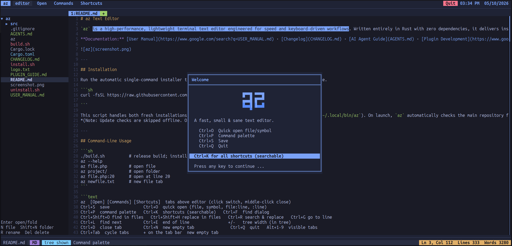

# az Text Editor

`az` is a high-performance, lightweight terminal text editor engineered for speed and keyboard-driven workflows. Written entirely in Rust with zero dependencies, it delivers instantaneous startup, robust syntax highlighting for 42 languages, and seamless project navigation without the overhead of configuration files or external plugins.

**Documentation:** [User Manual](https://www.google.com/search?q=USER_MANUAL.md) · [Changelog](CHANGELOG.md) · [AI Agent Guide](AGENTS.md) · [Plugin Development](https://www.google.com/search?q=PLUGIN_GUIDE.md)



---

## Installation

Run the automatic single-command installer to clone, build, and install `az` directly on your machine.

```sh
curl -fsSL https://raw.githubusercontent.com/arazgray/az/refs/heads/main/install.sh | sh

```

This script handles both fresh installations and in-place upgrades (rebuilding and reinstalling to `~/.local/bin/az`). On launch, `az` automatically checks the main repository for updates and provides an upgrade prompt if a newer release is detected.
*(Note: Update checks are skipped offline. Opt-out by setting `AZ_NO_UPDATE_CHECK=1`).*

---

## Command-Line Usage

```sh
az                  # Open empty editor
az file.php         # Open a specific file
az project/         # Open a directory and populate the project tree
az file.php:20      # Open a file and jump directly to line 20
az newfile.txt      # Initialize a new file in a new tab
az --help           # Display help and usage options
az --version        # Display current version

```

---

## Interface Overview

`az` is designed with a clean, Tokyo Night-inspired interface that maximizes screen real estate while keeping essential information visible.

```text
┌ az  [Open] [Commands] [Shortcuts] ──────────  02:30 PM  30/09/2026 ─┐
├─────────────────────────────────────────────────────────────────────┤
│                             │ 1:main.blade.php  2:style.css         │
│ ▾ project/                  │  1  @extends('layouts.app')           │
│   ▾ resources/              │  2  @section('content')               │
│     ▾ views/                │  3  <style>                           │
│       main.blade.php        │  4  #header { background: #fff; }     │
│       style.css             │  5  </style>                          │
│   Enter open/fold           │  6  <div id="app">{{ $user->name }}</div>│
│   N file  Shift+N folder    │  7  @if($x) … @endif                  │
├─────────────────────────────────────────────────────────────────────┤
└ main.blade.php  BLADE  tree shown │ Found $user  Ln 6… ───┘

```

### UI Components

* **Titlebar & Tabs:** Features interactive mode chips and a real-time clock. Active tabs are visually distinct, and modified files are marked with an asterisk (`*`). Press `Esc` to reveal `Alt+1-9` tab-switching hints.
* **Project Tree:** Automatically color-codes files by extension (e.g., PHP is purple, HTML is orange, JS is yellow) for rapid visual parsing.
* **Editor:** Supports mixed-language syntax highlighting on a single line, visible line numbers, and horizontal scrolling (no word wrap by design).
* **Status Bar:** Displays file path, modification state, active language, and document statistics. System messages flash light blue for immediate user feedback.

### Keyboard & Mouse Controls

| Action | Shortcut | Action | Shortcut |
| --- | --- | --- | --- |
| **Save File** | `Ctrl+S` | **Command Palette** | `Ctrl+P` |
| **Quick Open** | `Ctrl+O` | **Shortcuts Menu** | `Ctrl+K` |
| **Find (Case-sensitive with `%`)** | `Ctrl+F` | **Find in Files** | `Ctrl+Shift+O` |
| **Replace** | `Ctrl+R` | **Replace in Files** | `Ctrl+Shift+H` |
| **Find Next** | `Ctrl+L` | **Go to Line** | `Ctrl+G` |
| **Undo / Redo** | `Ctrl+Z` / `Ctrl+Y` | **End of Line** | `Ctrl+E` |
| **Copy / Cut / Paste** | `Ctrl+C` / `X` / `V` | **Select All** | `Ctrl+A` |
| **New File** | `Ctrl+N` | **Close Tab** | `Ctrl+D` |
| **Switch Tabs** | `Alt+1-9` | **Quit** | `Ctrl+Q` |
| **Focus Tree** | `Ctrl+T` | **Toggle Tree Visibility** | `Ctrl+H` |
| **Adjust Tree Width** | `+` / `-` (in tree) |  |  |

* **Mouse Support:** Full SGR mouse integration. Click to move cursor, open files, or switch tabs. Middle-click to close tabs. Drag to select text, double-click for word selection. Scroll wheel supported across editor, sidebar, and pickers. Right-click opens context-aware action menus.

---

## Core Capabilities

* **Navigation:** Browse via the project tree, Quick Open (fuzzy finding for files and symbols), global find-in-files, and line jumping.
* **Editing:** Includes 400-step undo/redo, auto-indentation, automatic bracket/tag closing, whole-line deletion, and reliable clipboard integration via system tools (`wl-copy`, `xclip`, `pbcopy`) with OSC52 fallback for SSH sessions.
* **Search & Replace:** Case-insensitive by default, with `%term` support for exact case matching. Features dedicated modals for workspace-wide find and replace operations.
* **Intelligent Completion:** Press `Tab` for context-aware completions, including language-specific variables, tags, attributes, keywords, and structural symbols.
* **Data Safety:** Utilizes atomic saves, per-project session restoration, and throttled background recovery (saved to `$XDG_STATE_HOME/az-rust`).
* **Terminal Native:** Raw-mode `stty` integration, 5MB bracketed paste support, truecolor rendering, wide-character awareness, and clean terminal state restoration on exit.

---

## Language Support (42 Built-In)

`az` automatically detects file types by extension and filename, applying targeted syntax highlighting, comment handling, and symbol extraction. Override the active language at any time via `Ctrl+P` → `set [Language]`.

| Language | Extensions/Files | Highlighting & Symbol Support |
| --- | --- | --- |
| **PHP** | `*.php`, `*.phtml` | Keywords, functions, `$vars`, comments (string+CSS aware), symbols |
| **Blade** | `*.blade.php` | `@directives`, `{{ }}`, mixed HTML+CSS+JS |
| **HTML** | `*.html`, `*.htm` | Tags, attributes, entities, void-tag auto-close |
| **CSS** | `*.css` | Properties, hex codes, `#id`, `@rules`, `!important`, selector symbols |
| **JavaScript** | `*.js`, `*.mjs`, `*.cjs`, `*.jsx` | Keywords, built-ins, template strings, regex, members, snippets |
| **TypeScript** | `*.ts`, `*.tsx`, `*.mts`, `*.cts` | JS features + `interface`/`type`/`enum`, symbols |
| **XML** | `*.xml`, `*.svg` | Tags, attributes, entities, `<?…?>`, `<!-- -->` |
| **Markdown** | `*.md` | Headings, bold, inline code, links, lists, symbols |
| **JSON** | `*.json`, `*.jsonc` | Strings, numbers, booleans, `//` and `/* */` (jsonc) |
| **TOML** | `*.toml` | `[sections]`, keys, values, `#` comments, symbols |
| **YAML** | `*.yaml`, `*.yml` | Keys, values, `#` comments, lists |
| **Bash** | `*.sh`, `*.bash`, `*.zsh` | `#!`, `$VAR`, keywords, built-ins, function symbols |
| **Dotenv** | `.env`, `*.env` | Keys, values, `export`, `#` comments |
| **INI** | `*.ini`, `*.conf`, `*.cfg` | `[sections]`, keys, `#`/`;` comments, symbols |
| **Logs** | `*.log` | Timestamps, semantic log levels (ERROR, WARN, INFO, DEBUG) |
| **Rust** | `*.rs` | Keywords, types, macros, `#[attrs]`, `fn/struct/enum` symbols |
| **Nginx** | `nginx.conf` | Blocks, directives, `$vars`, `#` comments, symbols |
| **Apache** | `.htaccess`, `httpd.conf` | Directives, `<Sections>`, `#` comments, symbols |
| **Dockerfile** | `Dockerfile*` | Instructions, `$vars`, `#` comments |
| **systemd** | `*.service`, `*.timer` | `[Sections]`, keys, `#`/`;` comments, symbols |
| **SQL** | `*.sql` | Keywords, strings, numbers, table creation symbols |
| **Python** | `*.py`, `*.pyw`, `*.pyi` | Keywords, `@decorators`, `def`/`class` symbols |
| **Java** | `*.java` | Keywords, types, `class`/`interface`/`enum`, method symbols |
| **C#** | `*.cs`, `*.csx` | Keywords, types, `[attrs]`, `class`/`namespace` symbols |
| **C++ / C** | `*.cpp`, `*.hpp`, `*.c`, `*.h` | Keywords, types, `#include`, `class`/`namespace`/`struct` symbols |
| **Go** | `*.go` | Keywords, types, `func`/`type` symbols |
| **Kotlin** | `*.kt`, `*.kts` | Keywords, types, `fun`/`class`/`object` symbols |
| **Swift** | `*.swift` | Keywords, `@attrs`, `func`/`struct`/`protocol` symbols |
| **Ruby** | `*.rb`, `Gemfile`, `Rakefile` | Keywords, `:symbols`, `def`/`class`/`module` symbols |
| **Dart** | `*.dart` | Keywords, types, `class`/`mixin` symbols |
| **Scala** | `*.scala`, `*.sc` | Keywords, types, `def`/`class`/`trait` symbols |
| **R** | `*.r` | Keywords, built-ins, `name <- function()` symbols |
| **Lua** | `*.lua` | Keywords, built-ins, `function` symbols |
| **Perl** | `*.pl`, `*.pm`, `*.t` | Keywords, `$@%` sigils, `sub`/`package` symbols |
| **Haskell** | `*.hs`, `*.lhs` | Keywords, types, definition symbols |
| **Elixir** | `*.ex`, `*.exs` | Keywords, `@attrs`, `def`/`defmodule` symbols |
| **Clojure** | `*.clj`, `*.cljs`, `*.edn` | Keywords, `:keywords`, `defn`/`ns` symbols |
| **Zig** | `*.zig` | Keywords, types, `fn`/`const`/`test` symbols |
| **Julia** | `*.jl` | Keywords, types, `function`/`struct`/`macro` symbols |
| **Objective-C** | `*.m`, `*.mm` | Keywords, types, `#import`, `@directives`, method symbols |
| **Plain Text** | `*.txt` | Fallback mode. No highlighting, always available. |

**Extending Languages via AI:**
`az` includes an [AI Agent Guide](AGENTS.md) that teaches LLM coding assistants the plugin API, architecture, and testing requirements. To add a new language, instruct your AI to scaffold the language implementation (`src/plugins/x.rs`), wire the routing, and add regression tests following the [Plugin Guide](https://www.google.com/search?q=PLUGIN_GUIDE.md).

---

## Recent Updates

### Version 2.6

* **20 New Language Plugins:** Added Python, Java, C#, C++, C, Go, Kotlin, Swift, Ruby, Dart, Scala, R, Lua, Perl, Haskell, Elixir, Clojure, Zig, Julia, and Objective-C. Includes auto-detection, dynamic keyword/type assignment, symbol extraction, and word completion.
* **Startup Update Check:** Silently compares the local version against the GitHub `main` branch (with short timeouts to prevent blocking). Alerts users to available upgrades via a modal dialog.
* **High-Frequency Mouse Scrolling:** Refactored event processing to capture high-burst touchpad scrolling. Kinetic scrolling is now fluid across the editor, sidebar, and pickers.
* **Robust Clipboard Processing:** Standard input is explicitly closed before awaiting system clipboards (`wl-copy`, `xclip`, etc.), eliminating hang states caused by broken clipboard pipes.

### Version 2.5

* **Global Replace in Files:** (`Ctrl+Shift+H`). Complete workflow for searching, reviewing match counts, and replacing terms across the entire project footprint (supports up to 3,000 files, skipping binaries and limits hits to 10k).
* **Right-Click Context Menus:** Native mouse integration for tab management, sidebar file operations (rename, delete, search here), and editor actions (cut/copy/paste, find/replace).
* **Enhanced Mouse Selection:** Drag-to-select functionality, double-click for word selection, triple-click for whole lines.
* **Blinking UI Alerts:** Status messages and prompts flash light blue to immediately draw attention.
* **Searchable Shortcuts Dialog:** (`Ctrl+K`). Browse and filter all available keyboard shortcuts within the editor.

---

## Building from Source

To compile the editor locally without relying on the remote script:

```sh
./build.sh

```

*This compiles `az` to `target/release/az` and installs it to `~/.local/bin/az`. It will automatically update your `~/.profile` to include `~/.local/bin` in your PATH if necessary (requires a terminal restart or sourcing `~/.profile`).*

To specify a custom binary directory:

```sh
AZ_BIN_DIR="$HOME/bin" ./build.sh

```

*Requires `cargo` (recommended) or `rustc`.*

---

## License

`az` is licensed under the [WTFPL](https://www.wtfpl.net/) (Do What The Fuck You Want To Public License).

You are free to copy, distribute, modify, and utilize this software for any purpose, including commercial applications, without restrictions. The software is provided "as is" without warranty of any kind.
